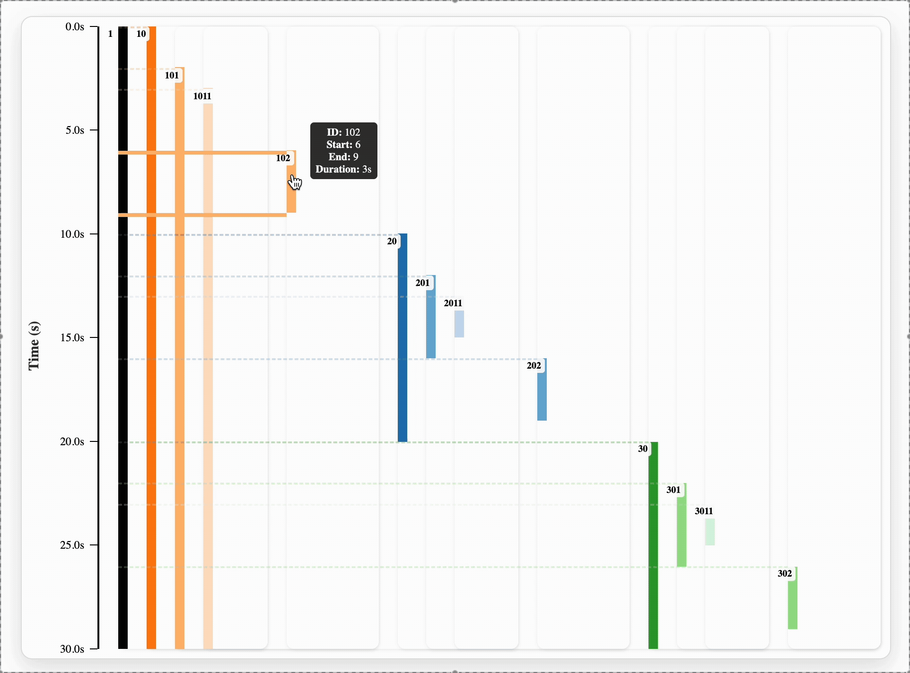
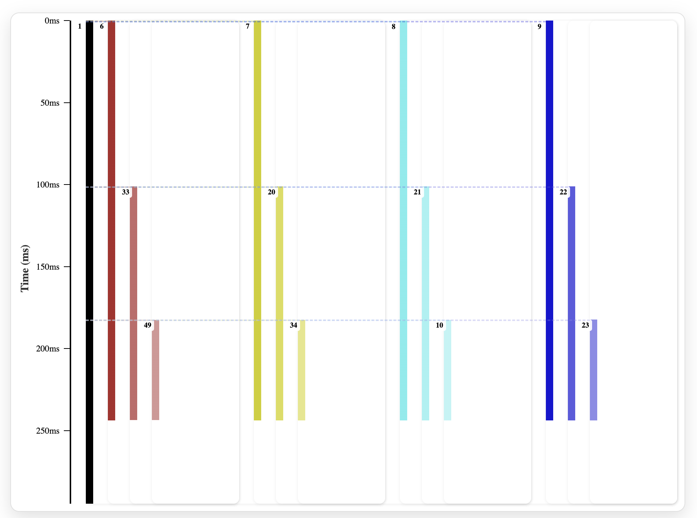
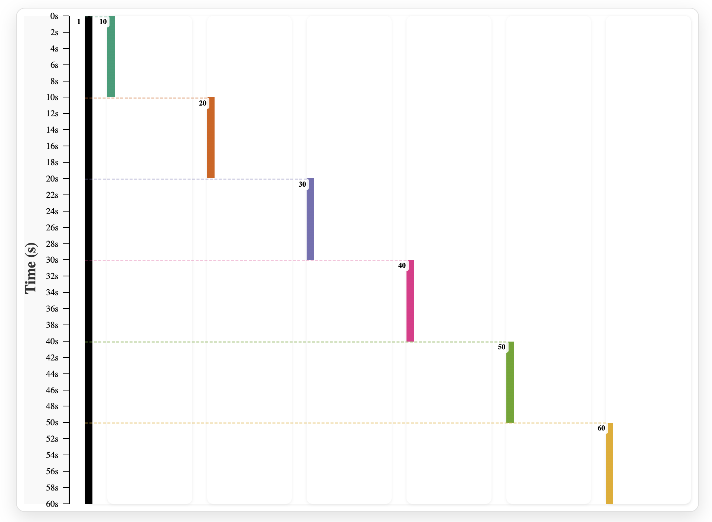
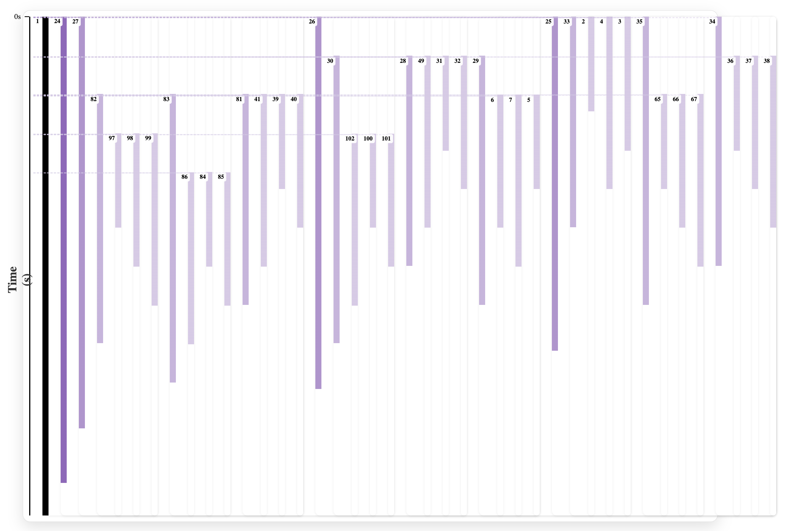
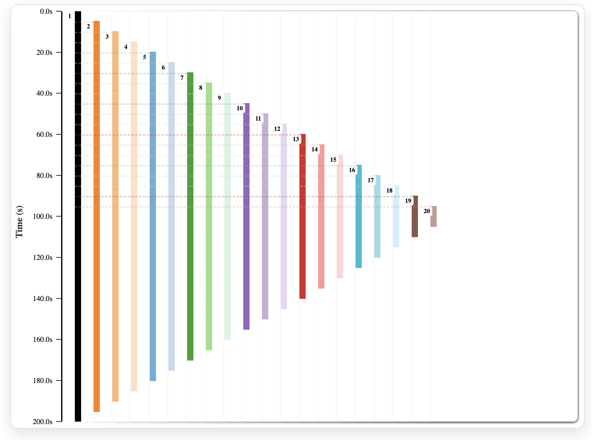
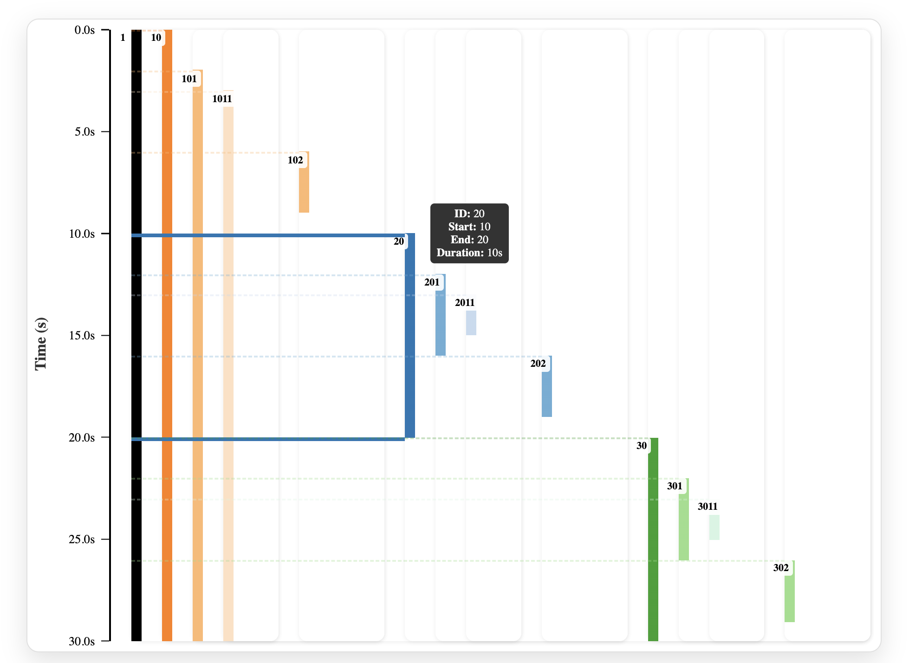

# Go Concurrency Visualiser

<p align="center">
  
</p>

**Go Concurrency Visualiser** is an interactive tool that transforms raw Go execution traces into clear, beautiful visualizations right in your browser. Instead of digging through plain text logs or struggling with dense tools, you can **see goroutines as a timeline**, explore parent–child relationships, and understand the flow of concurrent programs at a glance.

- Highlights the **structure of concurrency** — from goroutines spawned by `main` to deeply nested children.
- Uses **distinctive color coding and shading** to make relationships intuitive and easy to follow.
- Fully interactive: hover over bars to inspect IDs, start/end times, and durations.
- Built with Go for trace parsing and React for smooth frontend rendering.

Whether you’re debugging tricky race conditions, teaching concurrency concepts, or just curious how goroutines actually run, this project gives you a **new lens into Go’s concurrency model**.


## Usage and Examples

### Nested Concurrency (Parent → Child → Grandchild)




In this run, the `main` goroutine creates **four independent children**, and each child goes on to spawn its own child and then a grandchild in sequence. The structure forms a clear three-level hierarchy: `main → child → grandchild`.

The timeline helps you see how each branch develops its own vertical chain, with colors making it easy to distinguish each top-level child of `main`. As the work goes deeper, the shades lighten to represent the nested relationship, so you can trace how responsibility flows downward.

This pattern is common when tasks need to be broken down step-by-step — for example, a worker that spawns sub-workers, which themselves delegate fine-grained work.

**Code structure that produces this pattern:**

```go
func main() {
    // main spawns 4 children
    for i := 0; i < 4; i++ {
        go func() {
            // child
            go func() {
                // grandchild
                go func() {
                    // great-grandchild
                    // ... some logic ...
                }()
            }()
        }()
    }
}
```

**Another way to do this**

```go
func main() {
    go func() {          // child-1
        go func() {      // grandchild-1
            go func() {  // great-grandchild-1
                // some logic
            }()
        }()
    }()

    go func() {          // child-2
        go func() {      // grandchild-2
            go func() {  // great-grandchild-2
                // some logic
            }()
        }()
    }()

    // repeated 4 times
}

```


### Sequential Goroutines



In this pattern, goroutines are started **one after another**, and each must finish before the next one begins. Instead of overlapping execution, the program enforces a strict order of progression. The timeline turns into a **stair-step structure**, where every block of work completes fully before passing control to the next goroutine.

This is useful when tasks depend on the completion of previous ones or when concurrency is not desired, but goroutines are still used to preserve structural clarity. It shows that goroutines don’t always mean *parallel execution* — their behavior depends on how synchronization is managed.

**Code structure that produces this pattern:**

```go
func main() {
    // each child must finish before the next one starts
    for i := 0; i < 8; i++ {
        var wg sync.WaitGroup
        wg.Add(1)
        go func(i int) {
            defer wg.Done()
            time.Sleep(100 * time.Millisecond) // simulate work
        }(i)
        wg.Wait()
    }
}
```

### Fan-Out / Fan-In Pattern



In this example, a single goroutine (the root) **fans out** by launching many worker goroutines at once. Each worker processes a piece of work concurrently. Later, the results are **fanned in** as the main goroutine (or another coordinator) waits for all workers to complete.

In the visualizer, this shows up as a **broad wave of goroutines starting at the same time** (fan-out), followed by their eventual completion being synchronized (fan-in). The dense overlapping bars illustrate how Go distributes the work concurrently.

This is a common concurrency design pattern in Go — for example, when fetching data from multiple APIs in parallel, processing large datasets in chunks, or running distributed tasks simultaneously before aggregating results.

### Deep Recursive Spawns



Sometimes a goroutine spawns another goroutine that does the same, and so on — creating a chain of recursive spawns. Each new goroutine starts only after its parent begins, leading to a deep nested timeline where every block is contained inside the lifespan of its ancestor.

The visualization shows this as a staircase of goroutines, each layer nested inside the previous one. Top-level colors still help differentiate, while lighter shades track the recursive depth. This is useful when modeling divide-and-conquer algorithms, recursive searches, or tree traversals where each call delegates new work further down.

**Example code structure**

```go
func main() {
    go spawnRecursive(1)
}
// recursion with depth upto 20
func spawnRecursive(depth int) {
    if depth > 20 {
        return
    }

    // spawn the next goroutine recursively
    go spawnRecursive(depth + 1)

    // ... some logic for this goroutine ...
}
```

### Interactive Hover Tooltips



When you hover over any goroutine block in the chart, a tooltip pops up showing:

- **ID** of the goroutine
- **Start time**
- **End time**
- **Duration**

This makes it easy to inspect the lifecycle of individual goroutines without digging into raw trace data. Instead of just looking at bars, you can quickly understand timing details at a glance.

For example, in the image below, hovering over goroutine **20** reveals it started at **10s**, ended at **20s**, and ran for a total of **10 seconds**.


## Installation & Setup

**Clone the repository**

```bash
git clone https://github.com/Lakshyasaharan5/go-concurrency-visualiser.git
cd go-concurrency-visualiser
```

**Install Go dependencies:**

Make sure you have **Go 1.24** installed. Then run

```bash
go mod tidy
```

This will pull in required modules like `golang.org/x/exp/trace` and `honnef.co/go/gotraceui`.

**Install frontend dependencies**

Go to the frontend folder and install npm packages:

```bash
cd frontend
npm install
```

**Build the frontend**

Build the static frontend files into frontend/dist/:

```bash
cd frontend
sudo npm build dev
```

**Generate a trace file**

Use one of the examples in `trace_generators` to create a trace:

```bash
cd trace_generators
go run trace1.go
```

This produces a `trace.out` file at the project root. 


> Tip: You can use your code as well, just make sure to keep it between trace.

**Start the backend**

Our Go backend is going to serve the frontend.

```bash
go run main.go 
```

Open the link shown in the terminal (usually `http://localhost:8080`) in your browser.

Upload your `trace.out` file and see the **MAGIC**

### Docker Setup

Make sure you have docker installed on your machine. Build the image and run it.

```bash
docker build -t go-concurrency-visualiser .
docker run -p 8080:8080 go-concurrency-visualiser
```

## Future Work

Planned improvements and next steps for Go Concurrency Visualiser:

- **Color-coded blocking times** – highlight when goroutines are blocked (e.g., on I/O or synchronization) using distinct colors for better visibility.  
- **Channel visualization** – draw edges to show communication between goroutines via channels, making data flow easier to trace.  
- **Command-line interface (CLI)** – add a lightweight CLI tool to generate traces, parse them, and launch the frontend without extra steps.  


Contributions and suggestions are always welcome! ❤️


## License

This project is licensed under the MIT License — see the [LICENSE](./LICENSE) file for details.

